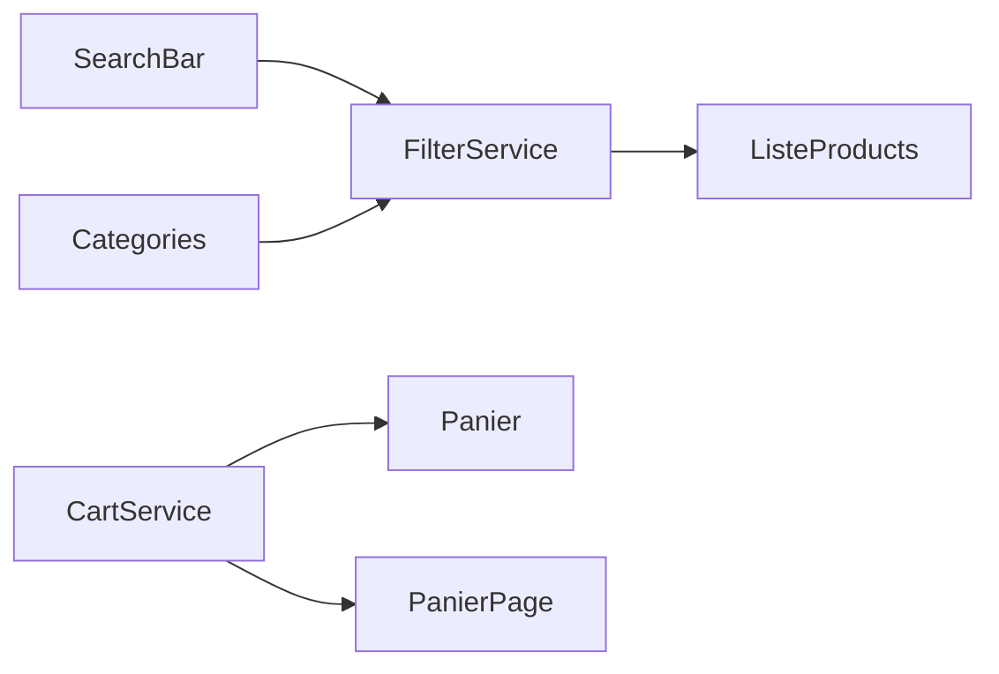

# EmiShop2 - Guide Interactif des Implémentations

Ce document explique toutes les fonctionnalités implémentées dans l'application EmiShop2.

---

## 🏗️ Architecture du Projet

```
src/app/
├── components/
│   ├── categories/          # Sidebar avec catégories dynamiques
│   ├── header/              # En-tête de l'application
│   ├── footer/              # Pied de page
│   ├── liste-products/      # Liste des produits avec pagination
│   ├── panier/              # Barre de panier en bas
│   ├── panier-page/         # Page panier complète
│   ├── product-detail/      # Détail d'un produit
│   └── search-bar/          # Barre de recherche
├── services/
│   ├── product.service.ts   # API DummyJSON
│   ├── cart.service.ts      # Gestion du panier
│   └── filter.service.ts    # État partagé recherche/filtre
├── models/
│   └── cart-item.ts         # Interface CartItem
└── app.routes.ts            # Configuration des routes
```

---

## 🔍 1. Fonctionnalité de Recherche

### Comment ça marche

1. **L'utilisateur tape** dans la barre de recherche et clique "Rechercher"
2. **SearchBar** appelle `FilterService.search(query)`
3. **FilterService** met à jour le `searchQuery$` BehaviorSubject
4. **ListeProducts** reçoit le changement via `combineLatest` et charge les résultats

### Fichiers clés

| Fichier | Rôle |
|---------|------|
| [search-bar.ts](file:///home/sami/Desktop/frontend/EmiShop2/src/app/components/search-bar/search-bar.ts) | Capture l'input et émet vers FilterService |
| [filter.service.ts](file:///home/sami/Desktop/frontend/EmiShop2/src/app/services/filter.service.ts) | Gère l'état partagé entre composants |
| [product.service.ts](file:///home/sami/Desktop/frontend/EmiShop2/src/app/services/product.service.ts#L60-L64) | Méthode `searchProducts()` |

### Code important

```typescript
// filter.service.ts - État partagé
search(query: string): void {
  this._selectedCategory$.next(null); // Efface le filtre catégorie
  this._searchQuery$.next(query);
}
```

---

## 📁 2. Filtrage par Catégorie

### Comment ça marche

1. Les catégories sont **chargées dynamiquement** depuis l'API DummyJSON
2. Cliquer sur une catégorie appelle `FilterService.filterByCategory(slug)`
3. **ListeProducts** reçoit le changement et charge les produits de cette catégorie

### API utilisée

```
GET https://dummyjson.com/products/categories
GET https://dummyjson.com/products/category/{slug}
```

### Fichiers clés

| Fichier | Rôle |
|---------|------|
| [categories.ts](file:///home/sami/Desktop/frontend/EmiShop2/src/app/components/categories/categories.ts) | Charge et affiche les catégories |
| [categories.html](file:///home/sami/Desktop/frontend/EmiShop2/src/app/components/categories/categories.html) | Template avec *ngFor dynamique |

---

## 📄 3. Pagination (Bouton "Plus")

### Comment ça marche

- Affiche **9 produits** initialement
- Si `products.length < totalProducts`, le bouton "Plus de produits" apparaît
- Cliquer charge 9 produits supplémentaires via `skip` + `pageSize`

### Code clé

```typescript
// liste-products.ts
loadMore(): void {
  this.currentSkip += this.pageSize;
  // Charge les 9 suivants selon le filtre actif
}

get hasMore(): boolean {
  return this.products.length < this.totalProducts;
}
```

---

## 🛍️ 4. Détail Produit

### Route

```
/product/:id
```

### Fonctionnalités

- **Galerie d'images** avec miniatures cliquables
- Toutes les **informations produit** : marque, SKU, stock, garantie, etc.
- Section **avis clients**
- Bouton **Ajouter au panier**

### Fichiers

| Fichier | Contenu |
|---------|---------|
| [product-detail.ts](file:///home/sami/Desktop/frontend/EmiShop2/src/app/components/product-detail/product-detail.ts) | Logique du composant |
| [product-detail.html](file:///home/sami/Desktop/frontend/EmiShop2/src/app/components/product-detail/product-detail.html) | Template complet |

---

## 🛒 5. Page Panier (Voir le panier)

### Route

```
/panier
```

### Améliorations

- **Grandes cartes produit** avec image, titre, prix
- **Contrôles de quantité** (+/-)
- **Résumé de commande** avec total
- Boutons "Continuer mes achats" et "Passer la commande"

### Fichiers

| Fichier | Contenu |
|---------|---------|
| [panier-page.ts](file:///home/sami/Desktop/frontend/EmiShop2/src/app/components/panier-page/panier-page.ts) | Logique |
| [panier-page.html](file:///home/sami/Desktop/frontend/EmiShop2/src/app/components/panier-page/panier-page.html) | Template |

---

## 🛣️ 6. Routing Angular

### Configuration

```typescript
// app.routes.ts
export const routes: Routes = [
  { path: '', loadComponent: () => ListeProducts },
  { path: 'product/:id', loadComponent: () => ProductDetail },
  { path: 'panier', loadComponent: () => PanierPage },
  { path: '**', redirectTo: '' }
];
```

### Concepts clés utilisés

| Concept | Explication |
|---------|-------------|
| **Lazy Loading** | `loadComponent: () => import(...)` charge les composants à la demande |
| **Route Parameters** | `:id` dans le chemin, récupéré via `ActivatedRoute.snapshot.paramMap.get('id')` |
| **routerLink** | Directive Angular pour la navigation sans rechargement de page |
| **router-outlet** | Zone où les composants routés sont affichés |

### Fichier principal

[app.routes.ts](file:///home/sami/Desktop/frontend/EmiShop2/src/app/app.routes.ts)

---

## 🔄 7. Gestion d'État avec Services

### Pattern utilisé



### Services

| Service | Observable | Usage |
|---------|------------|-------|
| FilterService | `searchQuery$`, `selectedCategory$` | Sync recherche/filtre |
| CartService | `items$` | Panier avec add/remove |

---

## 🧪 Tests Manuels

### Tester la recherche
1. Tapez "phone" dans la barre de recherche
2. Cliquez Rechercher
3. Vérifiez que les produits contiennent "phone"

### Tester les catégories
1. Cliquez sur "Laptops" dans la sidebar
2. Vérifiez que seuls les laptops s'affichent

### Tester la pagination
1. Scrollez en bas de la page
2. Cliquez "Plus de produits"
3. Vérifiez que plus de produits s'affichent

### Tester le détail produit
1. Cliquez sur un produit
2. Vérifiez l'URL: `/product/XX`
3. Vérifiez les informations complètes

### Tester le panier
1. Ajoutez des produits au panier
2. Cliquez "Voir panier"
3. Vérifiez les grandes cartes et les contrôles de quantité

---

## 📚 Ressources

- [Angular Router Documentation](https://angular.io/guide/router)
- [DummyJSON API](https://dummyjson.com/docs/products)
- [RxJS Operators](https://rxjs.dev/guide/operators)
